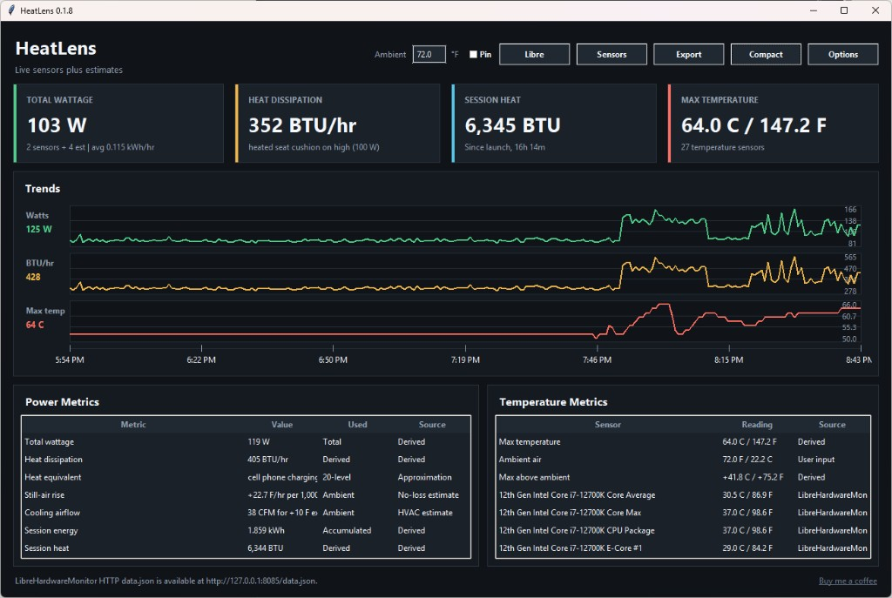

# HeatLens

**See how much heat your PC is putting into the room.**

[](LICENSE)
[](https://www.python.org/)
[](#quick-start)

HeatLens is a small Python desktop widget that answers a simple question:

> *How much heat is this computer adding to my room right now?*

It shows total wattage, heat dissipation in **BTU/hr**, session heat in **BTU**, live temperatures, and trend graphs — with clear labeling when values come from direct sensors vs estimates.



## Features

- **Total wattage** from hardware power sensors, with smart fallbacks
- **BTU/hr** and **session BTU** using standard conversion constants
- **Max temperature** with Pascal NVIDIA hot-spot handling
- **Trend graphs** for watts, BTU/hr, and temperature
- **Sensor inspector** — see every source and what counts toward the total
- **Ambient input** for above-ambient delta and rough air-heating context
- **Excel export** for monitoring sessions
- **Compact mode** for a smaller always-on-top widget

## Quick start

### Portable download (no Python required)

Pre-built binaries are attached to [GitHub Releases](https://github.com/arogorn993-hue/HeatLens/releases):

| Platform | File | Notes |
|----------|------|-------|
| **Windows** | `HeatLens.exe` | Double-click to run. Right-click → **Run as administrator** for extra ACPI/storage sensors. |
| **Linux** | `HeatLens` or `HeatLens-linux-x86_64.tar.gz` | `chmod +x HeatLens && ./HeatLens`. Needs X11/Wayland with Tk; RAPL/hwmon may need permissions. |

Place `LibreHardwareMonitor.exe` in the **same folder** as `HeatLens.exe` on Windows if you want the **Libre** button to find it easily.

To build locally:

```powershell
# Windows
.\scripts\build_windows.ps1
```

```bash
# Linux
bash scripts/build_linux.sh
```

### Windows (from source)

```powershell
git clone https://github.com/arogorn993-hue/HeatLens.git
cd HeatLens
py -3 -m pip install -r requirements.txt
.\run_heatlens.ps1
```

For motherboard, ACPI, or storage temperature counters that Windows sometimes blocks:

```powershell
.\run_heatlens_admin.ps1
```

### Linux

```bash
git clone https://github.com/arogorn993-hue/HeatLens.git
cd HeatLens
python3 -m pip install -r requirements.txt
./run_heatlens.sh
```

On Linux, HeatLens can read **Intel/AMD RAPL** package power from sysfs and **hwmon** power/temperature sensors when the kernel exposes them. AMD GPUs can be read through `rocm-smi` when installed.

### macOS

```bash
git clone https://github.com/arogorn993-hue/HeatLens.git
cd HeatLens
python3 -m pip install -r requirements.txt
python3 hardware_heat_widget.py
```

macOS support is estimate-oriented (CPU load + any temperatures `psutil` can see). NVIDIA GPUs still work if `nvidia-smi` is installed.

## Best sensor results

For the most complete Windows sensor coverage, run [LibreHardwareMonitor](https://github.com/LibreHardwareMonitor/LibreHardwareMonitor) with its web server enabled. HeatLens checks:

1. Libre/OpenHardwareMonitor `data.json` over HTTP (default port `8085`)
2. Libre/OpenHardwareMonitor WMI namespaces
3. `nvidia-smi` for NVIDIA GPU power/temperature
4. Native Windows ACPI and storage WMI counters (admin may be required)
5. Linux RAPL / hwmon / `rocm-smi` on supported systems
6. CPU/platform estimates through `psutil` when direct power sensors are unavailable

Use the **Sensors** button in HeatLens to see each live sensor, its source backend, and whether it contributes to total wattage.

On Windows, HeatLens can also **start LibreHardwareMonitor for you** if it is installed, or open the download page if it is not. Use the **Libre** button in the header any time to retry.

## FAQ

**Do I need LibreHardwareMonitor?**  
No. HeatLens works with `nvidia-smi`, Linux sensors, and estimates. Libre just gives the best coverage on Windows (CPU package power, motherboard, RAM, NVMe).

**Why does it say "estimated" wattage?**  
Some parts of a PC do not expose power sensors in software. HeatLens labels those rows with `~` so you can see what was measured directly vs inferred.

**Why is my total lower than a wall power meter?**  
Software usually cannot see monitor power, full PSU loss, or every platform rail. A plug-in meter at the wall is still the most accurate whole-system reading.

**How do I get the best results on Windows?**  
Install [LibreHardwareMonitor](https://github.com/LibreHardwareMonitor/LibreHardwareMonitor), click **Libre** in HeatLens to start it, then enable **Options → Remote Web Server → Run** (port 8085).

**Can I run it pinned on top?**  
Yes. Check **Pin** in the header, or use **Compact** for a smaller window.

## Heat math

HeatLens uses standard conversion constants:

```text
BTU/hr = watts × 3.412141633
BTU     = watt-hours × 3.412141633
kWh/hr  = watts / 1000
```

Session energy uses trapezoidal integration between samples so short spikes are averaged more fairly than a simple snapshot sum.

When direct sensors only cover CPU/GPU package power, HeatLens can add labeled estimates for motherboard/platform load, RAM DIMMs, NVMe/storage, and PSU conversion loss. Estimated rows are marked with `~` and shown separately in the Sensors view.

Ambient temperature input unlocks above-ambient delta, still-air room rise per 1,000 ft³, and approximate airflow needed for a 10 °F exhaust rise. Ambient does not add BTU/hr by itself.

A wall power meter is still the gold standard for whole-system room heat, because software sensors may omit monitor power, some PSU losses, or parts of the platform.

## License

MIT — see [LICENSE](LICENSE).

## Changelog

See [CHANGELOG.md](CHANGELOG.md).

## Support

If HeatLens is useful to you, [buy me a coffee](https://buymeacoffee.com/arogorn993hue) — totally optional, but appreciated.
